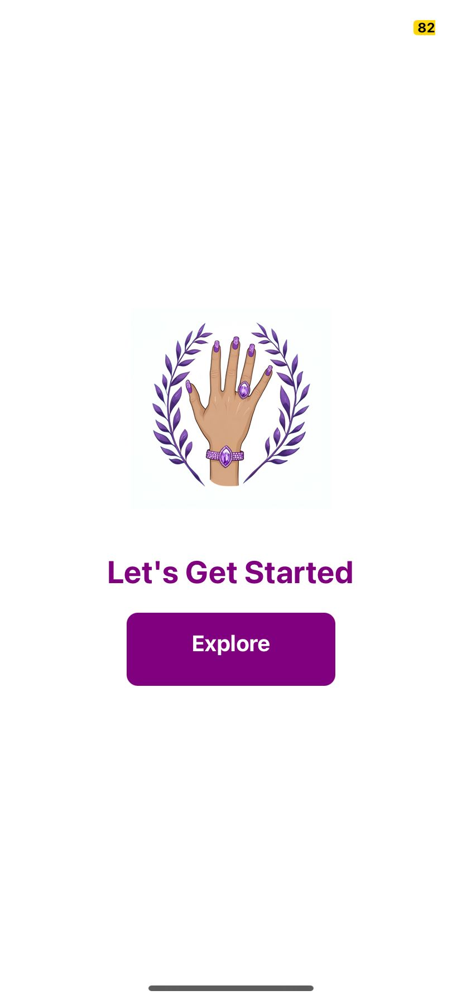
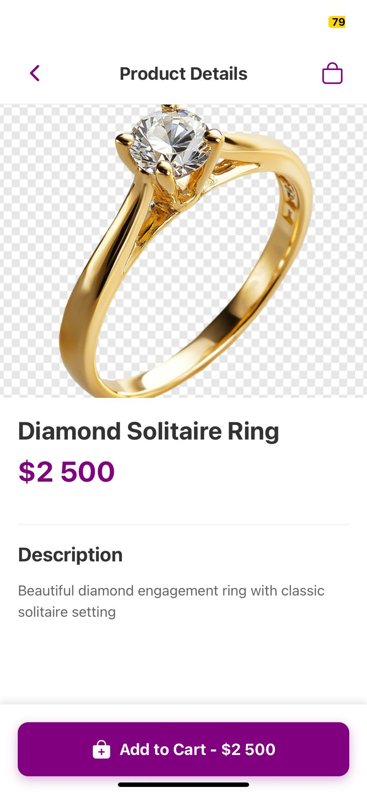
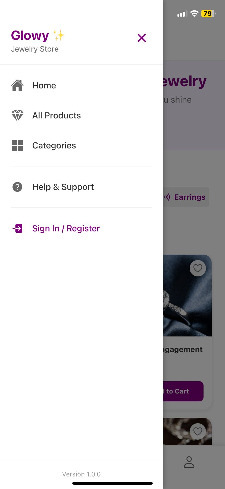

# GlowyApp ✨

GlowyApp is a full-stack project built with **ASP.NET Core (backend)** and **React Native with Expo Router (frontend)**.  
The backend provides APIs for authentication, shopping cart, and product management, while the frontend is a mobile app consuming these APIs.  

---
## User Interface (on Expo Go App - iOS)
<p align="center">
  
  
  
  
  
  
  
  
  
  
  
  
  
  
  
  
  
  
  
  
  
  
</p>


## Tech Stack

- **Backend**: ASP.NET Core Web API  
- **Frontend**: React Native + Expo Router  
- **Database**: SQLite
- **Tunneling**: ngrok

---

## Backend Setup

1. Navigate to the backend folder:

   ```bash
   cd backend/GlowyAPI

2. Restore dependencies and run:
   
   ```bash 
   dotnet restore
   dotnet run

3. By default, the backend runs on:
   
   ```http://localhost:5000```

---

## Frontend Setup

1. Navigate to the frontend folder:
   
   ```cd frontend```

2. Install dependencies:

   ```npm install```

3. Start the app:

   ```npx expo start```

4. Open on your device using Expo Go app.

---

## Connecting Backend & Frontend

1. Open Ngrok terminal:
   
   ```ngrok http 5000```

2. Copy the HTTPS URL from ngrok and update your API URL in `api.ts`:

   - Example ngrok URL:  
     ```
     https://thenumber.ngrok-free.app
     ```
   - This should point to your backend running at:  
     ```
     http://localhost:5000
     ```

   - Update your API URL in `api.ts`:
     ```typescript
     const API_URL = "https://thenumber.ngrok-free.app";
     ```

3. Restart the frontend app.

## Development Notes:
- When switching tunnels, always update frontend/api.ts with the new URL.

- For production, configure a proper backend host (e.g., Azure, AWS, or Railway).

- Use environment variables (.env) to avoid hardcoding URLs.